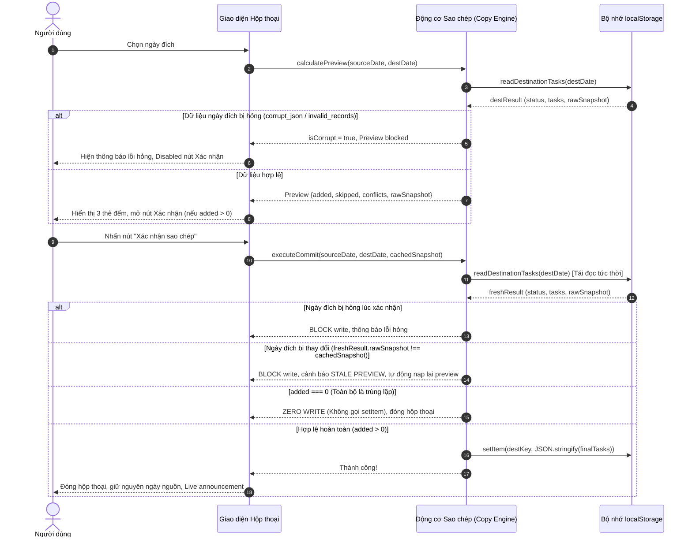

# Kiến trúc Dữ liệu & Giải thuật — Sao chép lịch sang ngày khác
**Tài liệu Kiến trúc Phần mềm (Software Architecture Document)**  
*Ngày ban hành: 01 tháng 10 năm 2026*  
*Vai trò: Architect (Tác vụ e6aa367e6192)*  
*Thuộc phiên bản: Vòng sửa đổi 2 — Tính năng "Sao chép lịch sang ngày khác"*

---

## 1. Tổng quan & Mục tiêu kiến trúc

Tính năng **"Sao chép lịch sang ngày khác"** cho phép người dùng nhân bản toàn bộ danh sách công việc từ một ngày nguồn (đang xem) sang một ngày đích khác trong ứng dụng *Lịch trình hằng ngày*.

Kiến trúc dữ liệu và giải thuật trong tài liệu này đặt ra các chuẩn mực nghiêm ngặt nhằm bảo đảm:
1. **Toàn vẹn dữ liệu (Data Integrity):** Không bao giờ làm hỏng, ghi đè hoặc làm mất dữ liệu hiện có ở ngày đích.
2. **Khử trùng lặp tất định (Deterministic Deduplication):** Định danh 4 trường (`title`, `start`, `end`, `category`), xử lý khử trùng nội bộ nguồn và khử trùng với ngày đích theo trật tự xác định.
3. **Phát hiện trùng khoảng giờ nghiêm ngặt (Strict Overlap Interval):** Giao nhau thực sự mới cảnh báo; tiếp xúc biên (`endA === startB`) là hợp lệ.
4. **Bảo vệ chống dữ liệu hỏng & Cam kết không ghi (Zero-Write Guarantee):** Phân biệt rành mạch 4 trạng thái lưu trữ của ngày đích (`missing`, `valid`, `corrupt_json`, `invalid_records`). Chặn hoàn toàn thao tác xem trước và ghi dữ liệu khi phát hiện hỏng; không thực hiện bất kỳ lệnh ghi nào khi số lượng thêm mới bằng 0.
5. **Chống bất đồng bộ dữ liệu (Stale Preview Mitigation):** Đọc lại và tính toán lại tại thời điểm bấm Xác nhận; phát hiện và chặn ghi nếu dữ liệu ngày đích bị thay đổi giữa lúc xem trước và xác nhận.
6. **Độc lập, an toàn và bảo mật (Safe DOM & Privacy):** Xử lý thuần túy tại trình duyệt, không thư viện, không kết nối ngoài, kiểm chứng số lần ghi `localStorage` mà không để lộ nội dung dữ liệu cá nhân.

---

## 2. Phân tích lược đồ lưu trữ & Tác vụ hiện tại (Current Baseline Schema)

### 2.1. Cấu trúc khóa `localStorage`
- Khóa lưu trữ theo ngày: `lich-trinh-hang-ngay:v1:YYYY-MM-DD` (tiền tố hằng số `STORAGE_PREFIX = "lich-trinh-hang-ngay:v1:"`).
- Giá trị lưu trữ: Chuỗi JSON đại diện cho mảng các đối tượng tác vụ: `Task[]`.

### 2.2. Lược đồ đối tượng Task hiện hành
```typescript
interface Task {
  id: string;          // Chuỗi định danh duy nhất (UUID v4 hoặc fallback chuỗi ngẫu nhiên)
  title: string;       // Chuỗi tiêu đề, sau khi trim có độ dài 1..120 ký tự
  start: string;       // Định dạng "HH:MM" (00:00 - 23:59)
  end: string;         // Định dạng "HH:MM" (00:00 - 23:59), điều kiện: start < end
  category: "company" | "personal"; // Danh mục hợp lệ
  priority: "low" | "medium" | "high"; // Mức ưu tiên hợp lệ
  completed: boolean;  // Trạng thái hoàn thành (true / false)
  createdAt: number;   // Timestamp (mili-giây tính từ Unix epoch)
}
```

### 2.3. Hạn chế của hàm nạp dữ liệu cơ sở (`loadTasks`)
Hàm `loadTasks` hiện tại trong `index.html` sử dụng `normalizeTask(raw, index)` kết hợp `.filter(Boolean)`. Cách xử lý này có tính "khoan dung" cho giao diện timeline (tự lọc bỏ bản ghi rác để hiển thị), nhưng **không an toàn** cho thao tác sao chép:
- Nếu ngày đích chứa mảng JSON có 2 bản ghi hợp lệ và 1 bản ghi bị hỏng trường `start`, `loadTasks` thông thường sẽ âm thầm nuốt lỗi và trả về mảng 2 phần tử. Khi thực hiện ghi dữ liệu mới, bản ghi thứ 3 sẽ bị biến mất vĩnh viễn (gây mất mát dữ liệu của người dùng).
- **Yêu cầu kiến trúc:** Thao tác sao chép bắt buộc phải sử dụng một bộ nạp nghiêm ngặt (`readDestinationTasks`), kiểm tra tính toàn vẹn 100% của toàn bộ các phần tử.

---

## 3. Quy chuẩn kiểm định tác vụ nghiêm ngặt (Strict Task Validation)

Hàm kiểm tra hợp lệ một bản ghi tác vụ lưu trữ `isValidStoredTask(record: unknown): boolean` phải thỏa mãn toàn bộ 10 điều kiện tiên quyết:

```javascript
function isValidStoredTask(raw) {
  // 1. Phải là một object hợp lệ (không null, không phải array)
  if (!raw || typeof raw !== "object" || Array.isArray(raw)) return false;

  // 2. id: chuỗi ký tự không rỗng
  if (typeof raw.id !== "string" || raw.id.trim().length === 0) return false;

  // 3. title: chuỗi ký tự, sau khi trim có độ dài từ 1 đến 120 ký tự
  if (typeof raw.title !== "string") return false;
  const trimmedTitle = raw.title.trim();
  if (trimmedTitle.length === 0 || trimmedTitle.length > 120) return false;

  // 4 & 5. start & end: định dạng giờ HH:MM (00:00 đến 23:59)
  if (typeof raw.start !== "string" || !isValidTime(raw.start)) return false;
  if (typeof raw.end !== "string" || !isValidTime(raw.end)) return false;

  // 6. Khoảng thời gian trong ngày: end phải sau start
  if (timeToMinutes(raw.end) <= timeToMinutes(raw.start)) return false;

  // 7. category: thuộc tập giá trị cho phép
  if (raw.category !== "company" && raw.category !== "personal") return false;

  // 8. priority: thuộc tập giá trị cho phép
  if (raw.priority !== "low" && raw.priority !== "medium" && raw.priority !== "high") return false;

  // 9. completed: bắt buộc là boolean nguyên thủy (không chấp nhận truthy/falsy ngầm định)
  if (typeof raw.completed !== "boolean") return false;

  // 10. createdAt: số thực hữu hạn (finite number)
  if (typeof raw.createdAt !== "number" || !Number.isFinite(raw.createdAt)) return false;

  return true;
}
```

---

## 4. Kết quả đọc dữ liệu ngày đích: Phân loại 4 trạng thái nghiêm ngặt

Hàm `readDestinationTasks(destDate: string)` chịu trách nhiệm thanh tra toàn diện khóa lưu trữ của ngày đích và trả về đối tượng có cấu trúc trạng thái phân định (`Discriminated Union`):

```typescript
type DestinationReadResult =
  | { status: "missing"; tasks: Task[]; rawSnapshot: null }
  | { status: "valid"; tasks: Task[]; rawSnapshot: string }
  | { status: "corrupt_json"; error: string; rawSnapshot: string }
  | { status: "invalid_records"; error: string; invalidIndices: number[]; rawSnapshot: string };
```

### 4.1. Chi tiết 4 trạng thái

1. **`missing` (Chưa từng tồn tại khóa lưu trữ):**
   - Điều kiện: `localStorage.getItem(key) === null`.
   - Ý nghĩa: Ngày đích chưa có dữ liệu nào. Đây là ngày đích trống hoàn toàn hợp lệ.
   - Kết quả: `tasks = []`, `rawSnapshot = null`. Cho phép xem trước và xác nhận ghi bình thường.

2. **`valid` (Dữ liệu hợp lệ 100%):**
   - Điều kiện: `raw !== null`, `JSON.parse(raw)` thành công, kết quả trả về là một mảng (`Array.isArray(parsed) === true`), và **mọi** phần tử trong mảng đều vượt qua `isValidStoredTask(item) === true`.
   - Ý nghĩa: Dữ liệu hiện có của ngày đích an toàn tuyệt đối.
   - Kết quả: Trả về mảng `tasks` nguyên bản và `rawSnapshot = raw` để dùng cho việc so sánh chống bất đồng bộ (stale check).

3. **`corrupt_json` (Lỗi cú pháp JSON hoặc sai kiểu mảng):**
   - Điều kiện: `raw !== null` nhưng `JSON.parse(raw)` ném lỗi ngoại lệ (SyntaxError), hoặc kết quả phân tích không phải là một `Array` (ví dụ: đối tượng `{}` hoặc chuỗi/số đơn lẻ).
   - Ý nghĩa: Tệp dữ liệu lưu trữ bị hỏng vật lý hoặc bị can thiệp sai cấu trúc.
   - Kết quả: Đánh dấu trạng thái lỗi hỏng.

4. **`invalid_records` (Có bản ghi tác vụ không hợp lệ):**
   - Điều kiện: `JSON.parse(raw)` trả về mảng, nhưng có ít nhất một chỉ mục `i` mà `isValidStoredTask(parsed[i]) === false`.
   - Ý nghĩa: Có bản ghi lỗi thời, thiếu trường bắt buộc, sai định dạng giờ hoặc sai danh mục.
   - Kết quả: Đánh dấu trạng thái lỗi hỏng, lưu lại danh sách `invalidIndices`.

### 4.2. Nguyên tắc Zero-Write khi gặp dữ liệu hỏng
- Khi `readDestinationTasks` trả về trạng thái `corrupt_json` hoặc `invalid_records`:
  - Biến cờ `isCorrupt` được thiết lập thành `true`.
  - Giao diện lập tức khóa vùng xem trước số liệu và vô hiệu hóa nút Xác nhận (`#copy-submit-button.disabled = true`).
  - Hiển thị banner cảnh báo lỗi theo thiết kế:
    *"⚠ Dữ liệu ngày đích trong bộ nhớ trình duyệt bị lỗi cấu trúc (JSON hỏng hoặc bản ghi không hợp lệ). Thao tác sao chép bị chặn để bảo vệ dữ liệu."*
  - **Cam kết Zero-Write:** Không được gọi `localStorage.setItem` hoặc `localStorage.removeItem`. Không thực hiện bất kỳ thay đổi nào lên vùng nhớ.

---

## 5. Định danh trùng lặp 4 trường & Khử trùng tất định (Deduplication)

### 5.1. Định danh trùng lặp chính xác (4-Field Exact Duplicate Identity)
Hai công việc được coi là trùng lặp hoàn toàn khi và chỉ khi khớp chính xác cả 4 trường sau:
1. `title`: Tiêu đề đã được cắt khoảng trắng đầu cuối (`task.title.trim()`).
2. `start`: Giờ bắt đầu (chuỗi `"HH:MM"`).
3. `end`: Giờ kết thúc (chuỗi `"HH:MM"`).
4. `category`: Danh mục (`"company"` hoặc `"personal"`).

> **RÀNG BUỘC KIẾN TRÚC QUAN TRỌNG:**
> Trường `priority` (mức ưu tiên) và `completed` (trạng thái hoàn thành) **tuyệt đối không tham gia** vào khóa định danh trùng lặp.
> Hai công việc cùng tiêu đề, cùng khung giờ và cùng danh mục nhưng khác mức ưu tiên (ví dụ: một bên `low`, một bên `high`) vẫn được coi là trùng lặp và không được tạo mới lần hai.

### 5.2. Biểu diễn khóa định danh
Khóa định danh tổng hợp được tạo ra một cách tất định (deterministic) thông qua chuỗi JSON mảng hoặc ký tự phân tách an toàn:
```javascript
function getTaskDuplicateKey(task) {
  return JSON.stringify([
    task.title.trim(),
    task.start,
    task.end,
    task.category
  ]);
}
```

### 5.3. Khử trùng tất định nội bộ nguồn (Within-Source Deduplication)
Trong trường hợp bản thân ngày nguồn có nhiều công việc trùng lặp lẫn nhau (ví dụ: người dùng đã tạo 2 việc cùng tên "Họp", cùng 09:00–10:00, cùng Company nhưng ID hoặc Priority khác nhau):
- Thuật toán duyệt qua danh sách công việc ngày nguồn theo trật tự thời gian ổn định (`sortedTasks()`: `start` tăng dần -> `end` tăng dần -> `createdAt` tăng dần).
- Bản ghi đầu tiên xuất hiện sẽ được giữ làm ứng viên sao chép.
- Mọi bản ghi tiếp theo có cùng `getTaskDuplicateKey` xuất hiện trong ngày nguồn sẽ bị coi là trùng lặp nội bộ và tính vào số lượng **Bỏ qua (skipped)**.

### 5.4. Khử trùng với ngày đích
- Tập hợp các khóa định danh đã có ở ngày đích: `existingKeys = new Set(destTasks.map(getTaskDuplicateKey))`.
- Nếu khóa của ứng viên nguồn đã tồn tại trong `existingKeys`, ứng viên đó sẽ bị bỏ qua và tính vào số lượng **Bỏ qua (skipped)**.
- Nếu chưa có, ứng viên được đưa vào danh sách **Sẽ thêm mới (added)**, đồng thời đưa khóa của nó vào `seenKeys` để chặn các mục trùng tiếp theo trong cùng lượt copy.

### 5.5. Định lý bất biến về số đếm tác vụ nguồn
Với bất kỳ tập công việc ngày nguồn gồm $N$ phần tử:
$$\text{added} + \text{skipped} = N$$
Mỗi công việc ngày nguồn chỉ có thể rơi vào đúng 1 trong 2 trạng thái: hoặc được thêm mới, hoặc bị bỏ qua do trùng lặp.

---

## 6. Hợp đồng chuyển đổi & Bảo toàn bản ghi (Transformation Contract)

### 6.1. Thuộc tính của tác vụ mới được sao chép
Mỗi tác vụ mới được sao chép sang ngày đích phải tuân thủ nghiêm ngặt các quy tắc chuyển đổi sau:

| Thuộc tính | Quy tắc xử lý | Giải thích lý do kiến trúc |
| :--- | :--- | :--- |
| `title` | **Bảo toàn nguyên vẹn** (`source.title.trim()`) | Giữ đúng nội dung công việc của người dùng. |
| `start` | **Bảo toàn nguyên vẹn** (`source.start`) | Giữ nguyên thời gian bắt đầu. |
| `end` | **Bảo toàn nguyên vẹn** (`source.end`) | Giữ nguyên thời gian kết thúc. |
| `category` | **Bảo toàn nguyên vẹn** (`source.category`) | Giữ nguyên phân loại Công ty / Cá nhân. |
| `priority` | **Bảo toàn nguyên vẹn** (`source.priority`) | Giữ nguyên mức độ ưu tiên của công việc gốc. |
| `id` | **Cấp ID duy nhất mới** (`makeId()`) | Tuyệt đối không dùng lại ID của ngày nguồn để tránh xung đột định danh trên toàn bộ hệ thống lưu trữ. |
| `createdAt` | **Cấp timestamp mới** (`Date.now()`) | Đánh dấu thời điểm bản ghi mới được sinh ra tại ngày đích. |
| `completed` | **Luôn đặt là `false`** | Không suy đoán hoàn thành; công việc sao chép sang ngày mới luôn bắt đầu ở trạng thái "Chưa hoàn thành". |

### 6.2. Bảo toàn tuyệt đối các tác vụ ngày đích hiện có
Mọi tác vụ hợp lệ đang tồn tại tại ngày đích (`destTasks`) phải được giữ nguyên 100%:
- Không bị thay đổi `id`, `title`, `start`, `end`, `category`, `priority`, `completed` hay `createdAt`.
- Danh sách cuối cùng lưu vào ngày đích là phép kết hợp:
  $$\text{finalTasks} = \text{destTasks} \cup \text{newlyCopiedTasks}$$
- Danh sách sau khi kết hợp có thể được sắp xếp theo hàm so sánh chuẩn (`start` -> `end` -> `createdAt`) khi hiển thị hoặc lưu trữ để đảm bảo tính nhất quán của dòng thời gian.

---

## 7. Giải thuật phát hiện trùng khoảng giờ nghiêm ngặt (Strict Overlap Math)

### 7.1. Định nghĩa toán học
Hai khoảng thời gian $A = [A_{start}, A_{end})$ và $B = [B_{start}, B_{end})$ bị coi là trùng giờ khi và chỉ khi phần giao giữa chúng là một khoảng dương:
$$\text{overlaps}(A, B) \iff A_{start} < B_{end} \land B_{start} < A_{end}$$

Trong đó, các mốc thời gian được quy đổi ra phút tính từ đầu ngày:
$$\text{timeToMinutes}(HH:MM) = \text{parseInt}(HH) \times 60 + \text{parseInt}(MM)$$

### 7.2. Xử lý trường hợp tiếp xúc biên (Boundary Contact)
Nếu hai công việc tiếp xúc nhau tại điểm đầu mút:
$$A_{end} = B_{start} \quad \text{hoặc} \quad B_{end} = A_{start}$$
Ví dụ: Công việc A từ `09:00` đến `10:00`, Công việc B từ `10:00` đến `11:00`.
- Do toán tử so sánh là `<` (nhỏ hơn nghiêm ngặt), điều kiện `09:00 < 10:00 && 10:00 < 10:00` trả về `false`.
- **Kết luận:** Tiếp xúc biên **không phải** là trùng giờ. Số đếm cảnh báo không được tăng trong trường hợp này.

### 7.3. Định nghĩa số đếm xung đột giờ (`conflictCount` hay $Z$)
Số đếm $Z$ thể hiện số lượng công việc *trong danh sách mới sao chép* có khoảng thời gian trùng lặp nghiêm ngặt với *ít nhất một công việc đã có sẵn* tại ngày đích:
$$Z = \Big|\big\{ t \in \text{newlyCopiedTasks} \;\big|\; \exists d \in \text{destTasks}: \text{overlaps}(t, d) \big\}\Big|$$

- Tính chất: $0 \le Z \le \text{added}$.
- Nếu ngày đích ban đầu là rỗng (`destTasks.length === 0`), $Z$ luôn luôn bằng 0.
- **Hành vi giao diện:** Cảnh báo trùng giờ là thông tin hỗ trợ tương tác, **không phải lỗi chặn**. Nếu $Z > 0$, hiển thị thông báo cảnh báo nhưng nút Xác nhận vẫn kích hoạt bình thường.

---

## 8. Quy trình Xác nhận, Kiểm tra Bất đồng bộ & Cam kết Không ghi

Quy trình sao chép được thiết kế theo mô hình 2 pha: **Pha xem trước (Preview Phase)** và **Pha xác nhận (Commit Phase)**.



### 8.1. Kiểm tra bất đồng bộ dữ liệu (Stale Preview Detection)
Trong môi trường trình duyệt, người dùng có thể mở nhiều tab hoặc thực hiện thay đổi dữ liệu ngày đích ở một tiến trình khác trong khi hộp thoại sao chép đang mở.
- Khi người dùng nhấn nút **"Xác nhận sao chép"**, động cơ sao chép **bắt buộc phải đọc lại** dữ liệu từ `localStorage`:
  `const freshResult = readDestinationTasks(destDate);`
- So sánh dấu vân tay chuỗi:
  `freshResult.rawSnapshot !== cachedSnapshot`
- Nếu phát hiện chuỗi lưu trữ thô đã thay đổi:
  1. Hủy bỏ ngay lập tức thao tác ghi dữ liệu (Zero Write).
  2. Báo lỗi giao diện: *"⚠ Dữ liệu ngày đích đã thay đổi. Kết quả tính toán đã được cập nhật lại, vui lòng kiểm tra trước khi xác nhận."*
  3. Cập nhật lại số liệu xem trước dựa trên `freshResult.tasks` và cập nhật `cachedSnapshot = freshResult.rawSnapshot`.

### 8.2. Cam kết Zero-Write khi `added === 0`
Nếu toàn bộ công việc từ ngày nguồn đều đã tồn tại tại ngày đích (hoặc do trùng lặp nội bộ nguồn đã có ở đích khiến $\text{added} = 0$):
- Tuyệt đối **không gọi** `localStorage.setItem(key, ...)`.
- Việc ghi đè một mảng giống hệt không chỉ lãng phí chu kỳ I/O mà còn có thể kích hoạt các sự kiện lưu trữ không cần thiết.
- Đóng hộp thoại hoặc hiển thị thông báo: *"Tất cả công việc từ ngày nguồn đều đã có ở ngày đích. Sẽ không có công việc nào được thêm mới và không ghi vào bộ nhớ."*

---

## 9. Mã giả thuật toán hoàn chỉnh (Implementation Pseudocode)

Các hàm nghiệp vụ dưới đây được cấu trúc dưới dạng hàm thuần túy (pure functions), hoàn toàn độc lập với DOM để tiện cho việc kiểm thử tự động (Unit Test / Integration Test):

```javascript
/**
 * Trích xuất khóa định danh trùng lặp 4 trường
 */
function getTaskDuplicateKey(task) {
  return JSON.stringify([
    task.title.trim(),
    task.start,
    task.end,
    task.category
  ]);
}

/**
 * Kiểm định cấu trúc một bản ghi tác vụ lưu trữ
 */
function isValidStoredTask(raw) {
  if (!raw || typeof raw !== "object" || Array.isArray(raw)) return false;
  if (typeof raw.id !== "string" || raw.id.trim().length === 0) return false;
  if (typeof raw.title !== "string") return false;
  const trimmedTitle = raw.title.trim();
  if (trimmedTitle.length === 0 || trimmedTitle.length > 120) return false;
  if (typeof raw.start !== "string" || !isValidTime(raw.start)) return false;
  if (typeof raw.end !== "string" || !isValidTime(raw.end)) return false;
  if (timeToMinutes(raw.end) <= timeToMinutes(raw.start)) return false;
  if (raw.category !== "company" && raw.category !== "personal") return false;
  if (raw.priority !== "low" && raw.priority !== "medium" && raw.priority !== "high") return false;
  if (typeof raw.completed !== "boolean") return false;
  if (typeof raw.createdAt !== "number" || !Number.isFinite(raw.createdAt)) return false;
  return true;
}

/**
 * Đọc dữ liệu ngày đích với phân loại 4 trạng thái
 */
function readDestinationTasks(destDate) {
  if (!isValidDateValue(destDate)) {
    return { status: "invalid_date", error: "Ngày không đúng định dạng", rawSnapshot: null, tasks: [] };
  }
  
  const key = STORAGE_PREFIX + destDate;
  let raw = null;
  try {
    raw = window.localStorage.getItem(key);
  } catch (e) {
    // Trường hợp localStorage bị cấm quyền truy cập
    const memData = memoryStore.get(destDate);
    if (!memData) return { status: "missing", tasks: [], rawSnapshot: null };
    const allValid = memData.every(isValidStoredTask);
    return allValid 
      ? { status: "valid", tasks: memData.slice(), rawSnapshot: "memory" }
      : { status: "invalid_records", error: "Bản ghi bộ nhớ không hợp lệ", rawSnapshot: "memory", invalidIndices: [] };
  }

  // Khóa chưa từng tồn tại
  if (raw === null) {
    return { status: "missing", tasks: [], rawSnapshot: null };
  }

  // Thử parse cú pháp JSON
  let parsed = null;
  try {
    parsed = JSON.parse(raw);
  } catch (err) {
    return { status: "corrupt_json", error: "JSON cú pháp hỏng: " + err.message, rawSnapshot: raw };
  }

  // Kiểm tra kiểu mảng gốc
  if (!Array.isArray(parsed)) {
    return { status: "corrupt_json", error: "Cấu trúc gốc không phải danh sách mảng", rawSnapshot: raw };
  }

  // Kiểm tra từng bản ghi
  const invalidIndices = [];
  for (let i = 0; i < parsed.length; i++) {
    if (!isValidStoredTask(parsed[i])) {
      invalidIndices.push(i);
    }
  }

  if (invalidIndices.length > 0) {
    return {
      status: "invalid_records",
      error: "Tồn tại " + invalidIndices.length + " bản ghi không hợp lệ",
      invalidIndices: invalidIndices,
      rawSnapshot: raw
    };
  }

  return {
    status: "valid",
    tasks: parsed,
    rawSnapshot: raw
  };
}

/**
 * Tính toán giải thuật sao chép và số liệu xem trước
 */
function calculateScheduleCopy(sourceTasks, destTasks) {
  // Sắp xếp sourceTasks theo trật tự thời gian ổn định
  const sortedSource = sourceTasks.slice().sort(function(a, b) {
    return a.start.localeCompare(b.start) || a.end.localeCompare(b.end) || a.createdAt - b.createdAt;
  });

  const existingDestKeys = new Set(destTasks.map(getTaskDuplicateKey));
  const seenSourceKeys = new Set();
  
  const tasksToAdd = [];
  let skippedCount = 0;

  for (let i = 0; i < sortedSource.length; i++) {
    const src = sortedSource[i];
    const key = getTaskDuplicateKey(src);

    // Kiểm tra trùng nội bộ nguồn hoặc trùng với ngày đích
    if (seenSourceKeys.has(key) || existingDestKeys.has(key)) {
      skippedCount++;
    } else {
      seenSourceKeys.add(key);
      tasksToAdd.push({
        id: makeId(),
        title: src.title.trim(),
        start: src.start,
        end: src.end,
        category: src.category,
        priority: src.priority,
        completed: false, // Luôn reset completed
        createdAt: Date.now() // Timestamp tạo mới
      });
    }
  }

  // Đếm số lượng công việc mới trùng khoảng giờ với ngày đích (tiếp xúc biên không tính)
  let conflictCount = 0;
  for (let i = 0; i < tasksToAdd.length; i++) {
    const cand = tasksToAdd[i];
    const hasOverlap = destTasks.some(function(d) {
      return overlaps(cand, d);
    });
    if (hasOverlap) {
      conflictCount++;
    }
  }

  return {
    tasksToAdd: tasksToAdd,
    addedCount: tasksToAdd.length,
    skippedCount: skippedCount,
    conflictCount: conflictCount
  };
}

/**
 * Điều phối thực thi sao chép có kiểm soát bất đồng bộ và bảo vệ dữ liệu
 */
function commitScheduleCopy(sourceDate, destDate, cachedSnapshot) {
  // 1. Kiểm tra hợp lệ ngày
  if (sourceDate === destDate) {
    return { ok: false, error: "same_date", message: "Ngày đích phải khác ngày nguồn." };
  }

  // 2. Tái đọc ngày đích tức thì
  const freshRead = readDestinationTasks(destDate);
  if (freshRead.status === "corrupt_json" || freshRead.status === "invalid_records") {
    return { 
      ok: false, 
      error: "corrupt_destination", 
      message: "Dữ liệu ngày đích bị hỏng cấu trúc. Thao tác sao chép bị hủy để bảo vệ dữ liệu." 
    };
  }

  // 3. Kiểm tra bất đồng bộ (Stale preview)
  if (freshRead.rawSnapshot !== cachedSnapshot) {
    return {
      ok: false,
      error: "stale_preview",
      message: "Dữ liệu ngày đích đã thay đổi trước khi xác nhận. Vui lòng kiểm tra lại.",
      freshResult: freshRead
    };
  }

  // 4. Lấy dữ liệu nguồn hợp lệ
  const currentSourceTasks = loadTasks(sourceDate);
  if (currentSourceTasks.length === 0) {
    return { ok: false, error: "empty_source", message: "Ngày nguồn không có công việc để sao chép." };
  }

  // 5. Tính toán danh sách công việc cần thêm
  const copyPlan = calculateScheduleCopy(currentSourceTasks, freshRead.tasks);

  // 6. Cam kết Zero-Write khi không có gì mới
  if (copyPlan.addedCount === 0) {
    return {
      ok: true,
      wrote: false,
      addedCount: 0,
      skippedCount: copyPlan.skippedCount,
      conflictCount: 0,
      message: "Tất cả công việc đã tồn tại ở ngày đích. Không có thay đổi nào được ghi."
    };
  }

  // 7. Thực hiện ghi dữ liệu an toàn
  const finalTasks = freshRead.tasks.concat(copyPlan.tasksToAdd);
  try {
    window.localStorage.setItem(STORAGE_PREFIX + destDate, JSON.stringify(finalTasks));
    memoryStore.set(destDate, finalTasks.slice());
    return {
      ok: true,
      wrote: true,
      addedCount: copyPlan.addedCount,
      skippedCount: copyPlan.skippedCount,
      conflictCount: copyPlan.conflictCount
    };
  } catch (err) {
    return { ok: false, error: "storage_error", message: "Lỗi ghi vào localStorage: " + err.message };
  }
}
```

---

## 10. Danh mục các bất biến toán học kiểm chứng được (Formal Testable Invariants)

Hệ thống đảm bảo 12 bất biến toán học không thể bị phá vỡ trong mọi tình huống thực thi:

1. **Bất biến bảo toàn số lượng tác vụ nguồn:**  
   $\forall \text{ batch}: \text{added} + \text{skipped} = |\text{sourceTasks}|$
2. **Bất biến cam kết không ghi khi không thêm mới (Zero-Write on Zero Added):**  
   $\text{added} = 0 \implies \Delta(\text{localStorage.setItem}) = 0$
3. **Bất biến chặn đứng khi dữ liệu đích hỏng (Zero-Write on Corruption):**  
   $\text{status} \in \{\text{corrupt\_json}, \text{invalid\_records}\} \implies \Delta(\text{localStorage}) = 0 \land \text{canSubmit} = \text{false}$
4. **Bất biến chặn đứng khi dữ liệu đích bị thay đổi bất đồng bộ (Zero-Write on Stale):**  
   $\text{currentSnapshot} \ne \text{cachedSnapshot} \implies \Delta(\text{localStorage}) = 0 \land \text{error} = \text{"stale\_preview"}$
5. **Bất biến bảo toàn 100% tác vụ đích hiện có:**  
   $\forall d \in \text{destTasks}_{\text{before}}: d \in \text{destTasks}_{\text{after}}$ (giữ nguyên toàn bộ giá trị thuộc tính).
6. **Bất biến đặt lại trạng thái hoàn thành:**  
   $\forall t \in \text{tasksToAdd}: t.\text{completed} = \text{false}$
7. **Bất biến làm mới ID duy nhất:**  
   $\forall t \in \text{tasksToAdd}: t.\text{id} \notin \text{sourceTasks.ids} \land t.\text{id} \notin \text{destTasks.ids}$
8. **Bất biến làm mới thời điểm tạo:**  
   $\forall t \in \text{tasksToAdd}: t.\text{createdAt} \ge T_{\text{copy\_start}}$
9. **Bất biến bảo toàn 5 trường thuộc tính:**  
   $\forall t \in \text{tasksToAdd}, \exists s \in \text{sourceTasks}: (t.\text{title}, t.\text{start}, t.\text{end}, t.\text{category}, t.\text{priority}) = (s.\text{title.trim()}, s.\text{start}, s.\text{end}, s.\text{category}, s.\text{priority})$
10. **Bất biến giới hạn số đếm trùng khoảng giờ:**  
    $0 \le \text{conflictCount} \le \text{added}$
11. **Bất biến loại trừ tiếp xúc biên:**  
    Nếu $t.\text{end} = d.\text{start}$ hoặc $d.\text{end} = t.\text{start}$, thì $\text{overlaps}(t, d) = \text{false}$.
12. **Bất biến duy trì ngày xem lịch:**  
    $\text{activeViewDate}_{\text{after}} = \text{sourceDate}_{\text{before}}$

---

## 11. Phương pháp đo lường & Xác minh số lần ghi LocalStorage không làm lộ dữ liệu

Nhằm đáp ứng yêu cầu của tiêu chuẩn phát triển web và các bài kiểm tra QA độc lập mà không làm rò rỉ thông tin cá nhân của người dùng vào log console hay báo cáo:

### 11.1. Cơ chế giám sát đếm lượt ghi (Write Counter Spy)
QA hoặc bộ kiểm tra smoke có thể cài đặt một wrapper theo dõi nhẹ vào đối tượng `Storage.prototype.setItem`:

```javascript
function createStorageWriteObserver() {
  const originalSetItem = window.localStorage.setItem;
  const calls = [];

  window.localStorage.setItem = function(key, value) {
    // Chỉ ghi nhận metadata (tên khóa, độ dài, thời điểm), tuyệt đối không in nội dung value
    calls.push({
      key: key,
      byteLength: typeof value === "string" ? value.length : 0,
      timestamp: Date.now()
    });
    return originalSetItem.apply(this, arguments);
  };

  return {
    getCallCount: function() { return calls.length; },
    getCallsForKey: function(targetKey) { return calls.filter(c => c.key === targetKey); },
    reset: function() { calls.length = 0; },
    restore: function() { window.localStorage.setItem = originalSetItem; }
  };
}
```

### 11.2. Bảng ma trận kiểm chứng số lần ghi dự kiến (Expected Write Counts Matrix)

| Kịch bản kiểm thử | Trạng thái nguồn | Trạng thái đích | Số lượng thêm (added) | Số lần gọi `setItem` dự kiến |
| :--- | :--- | :--- | :--- | :--- |
| **TC-01:** Sao chép sang ngày đích trống | 3 việc hợp lệ | Trống (`missing`) | 3 | **Đúng 1 lần** (trên khóa ngày đích) |
| **TC-02:** Sao chép sang ngày đích có sẵn việc khác | 2 việc hợp lệ | 2 việc hợp lệ (khác khóa) | 2 | **Đúng 1 lần** (trên khóa ngày đích) |
| **TC-03:** Toàn bộ công việc bị trùng lặp | 2 việc hợp lệ | Đã chứa đủ 2 việc đó | 0 | **Chính xác 0 lần** (Zero-Write) |
| **TC-04:** Ngày đích có JSON hỏng | 2 việc hợp lệ | JSON hỏng (`corrupt_json`) | Bị chặn | **Chính xác 0 lần** (Zero-Write) |
| **TC-05:** Ngày đích có bản ghi thiếu trường | 2 việc hợp lệ | Bản ghi lỗi (`invalid_records`) | Bị chặn | **Chính xác 0 lần** (Zero-Write) |
| **TC-06:** Ngày nguồn rỗng | 0 việc | Bất kỳ | Nút bấm disable | **Chính xác 0 lần** (Zero-Write) |
| **TC-07:** Ngày đích trùng ngày nguồn | 2 việc | Trùng ngày nguồn | Bị chặn lỗi form | **Chính xác 0 lần** (Zero-Write) |
| **TC-08:** Dữ liệu đích thay đổi giữa chừng | 2 việc | Đổi dữ liệu trước khi bấm Lưu | Stale blocked | **Chính xác 0 lần** (Zero-Write) |
| **TC-09:** Nhấn Hủy hoặc phím Escape | 2 việc | Bất kỳ | Đóng dialog | **Chính xác 0 lần** (Zero-Write) |

---

## 12. Bằng chứng bàn giao kiến trúc (Handoff Evidence)

1. **Các tệp cơ sở đã thanh tra:**
   - `index.html`: Thanh tra kỹ hàm `loadTasks`, `saveTasks`, `normalizeTask`, `overlaps`, `overlapMatches`, lược đồ các phần tử DOM và cơ chế lưu trữ.
   - `DESIGN.md`: Đã nghiên cứu Mục 13 vừa được bổ sung bởi Designer (ngày 01/10/2026), đảm bảo khớp nối 100% về nhãn microcopy, cấu trúc `<dialog>`, cơ chế bàn phím và giao diện hiển thị.
   - `README.md` & `BROWSER_QA.md`: Kiểm tra các kết quả nghiệm thu vòng 1 và ghi nhận các giới hạn kỹ thuật để không phá vỡ tính tương thích ngược.

2. **Các cam kết kiến trúc:**
   - Hoàn toàn độc lập, không thêm bất kỳ thư viện hoặc phụ thuộc bên ngoài nào.
   - Không can thiệp sửa đổi giao diện `index.html` trong tác vụ kiến trúc này (đúng phạm vi phân vai `architect`).
   - Sẵn sàng bàn giao cho vai trò `frontend` triển khai và vai trò `qa` xây dựng bộ test case kiểm thử.
