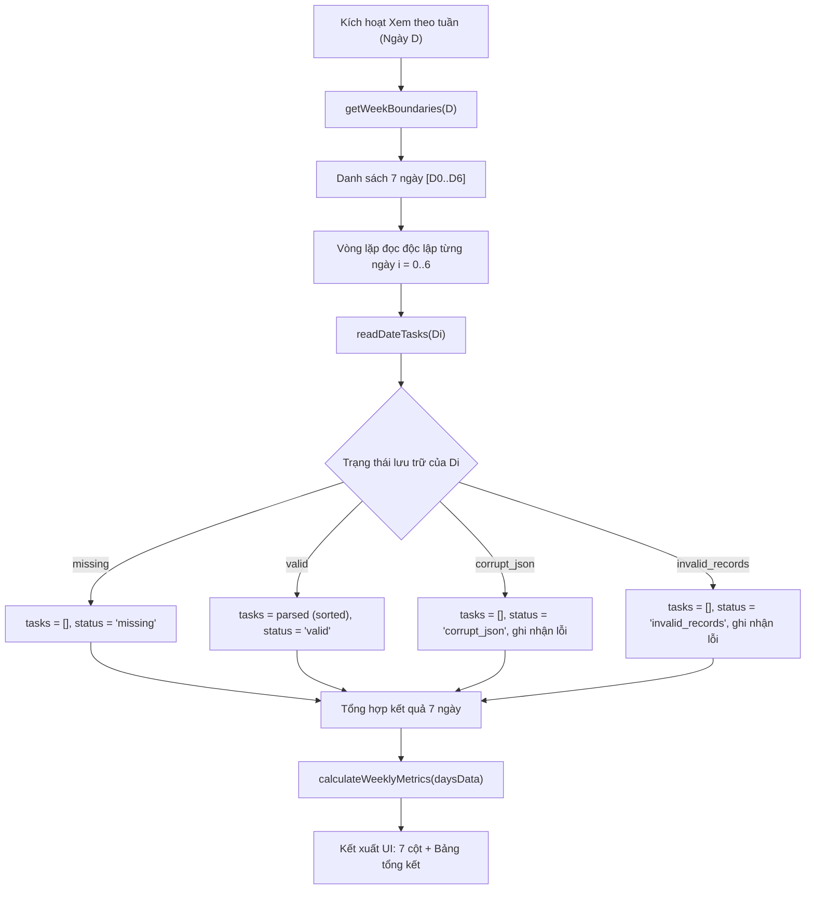
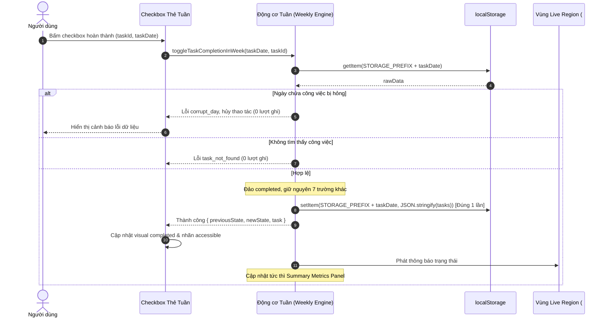

# Kiến trúc Dữ liệu & Giải thuật — Quản lý công việc tuần
**Tài liệu Kiến trúc Phần mềm (Software Architecture Document)**  
*Ngày ban hành: 01 tháng 10 năm 2026*  
*Vai trò: Architect (Tác vụ 2e134dacc27f)*  
*Thuộc phiên bản: Vòng sửa đổi 3 — Tính năng "Quản lý công việc tuần" (Weekly Task Management)*

---

## 1. Tổng quan & Mục tiêu kiến trúc

Tính năng **"Quản lý công việc tuần"** mở rộng ứng dụng *Lịch trình hằng ngày* độc lập bằng việc cung cấp giao diện trực quan 7 ngày (từ Thứ Hai đến Chủ Nhật). Tính năng này giúp người dùng nắm bắt bức tranh toàn cảnh về khối lượng công việc, theo dõi tiến độ hoàn thành, và chuyển đổi linh hoạt giữa góc nhìn tổng quan tuần và góc nhìn chi tiết ngày.

Kiến trúc dữ liệu và giải thuật trong tài liệu này được thiết kế dựa trên các nguyên tắc bất biến:
1. **Nguồn chân lý duy nhất (Single Source of Truth):** Không tạo thêm bất kỳ khóa lưu trữ cấp tuần nào (như `week:YYYY-Wxx`). Dữ liệu tuần được tổng hợp động trực tiếp tại thời điểm chạy (on-the-fly) từ 7 khóa ngày hiện hành (`lich-trinh-hang-ngay:v1:YYYY-MM-DD`). Loại bỏ triệt để nguy cơ trôi lệch dữ liệu (secondary desync).
2. **Thuật toán biên tuần tất định (Deterministic Week Boundary Calculation):** Tính toán chính xác 7 ngày liên tiếp từ Thứ Hai đến Chủ Nhật cho bất kỳ chuỗi ngày chuẩn ISO nào (`YYYY-MM-DD`), xử lý hoàn hảo các biên chuyển tháng, năm nhuận (29/02), năm thường (28/02) và chuyển giao năm mới.
3. **Bộ nạp ngày nghiêm ngặt & Cơ chế cô lập lỗi (Strict Date Loader & Fault Isolation):** Kế thừa và chuẩn hóa `isValidStoredTask` và `readDateTasks`, phân định rõ 4 trạng thái lưu trữ (`missing`, `valid`, `corrupt_json`, `invalid_records`). Nếu 1 ngày bị hỏng cấu trúc, ngày đó hiển thị cảnh báo lỗi độc lập mà không làm sập giao diện tuần hoặc ảnh hưởng tới 6 ngày còn lại.
4. **Hợp đồng đột biến hoàn thành chính xác (Completion Mutation Contract):** Bật/tắt trạng thái hoàn thành từ giao diện tuần chỉ cập nhật duy nhất khóa ngày của công việc đó; bảo toàn 100% các trường dữ liệu và thứ tự bản ghi khác; thực hiện đúng 1 lượt ghi vào ngày đó và 0 lượt ghi vào các ngày khác.
5. **Số liệu tuần & Bất biến toán học (Metrics & Formal Invariants):** Định nghĩa công thức tính toán `totalWeeklyTasks`, `completedWeeklyTasks`, `remainingWeeklyTasks`, và `completionRate`; cung cấp 12 bất biến toán học phục vụ kiểm thử QA độc lập.
6. **Điểm móc kiểm thử trong suốt (Testable Hooks & Spy Observation):** Cung cấp API thuần túy trên `window.__weeklyEngine` hỗ trợ kiểm thử tự động và quan sát lượt ghi `localStorage` mà không làm lộ dữ liệu cá nhân của người dùng.

---

## 2. Tính toán biên tuần tất định (Week Boundaries Calculation)

### 2.1. Chuẩn quy ước tuần
- **Ngày bắt đầu tuần:** Thứ Hai (Monday) — phù hợp với tiêu chuẩn ISO-8601 và văn hóa làm việc/học tập tại Việt Nam.
- **Ngày kết thúc tuần:** Chủ Nhật (Sunday).
- **Số ngày trong một tuần:** Luôn đúng $7$ ngày liên tiếp.

### 2.2. Phân tích giải thuật tính toán
Trong JavaScript, phương thức `Date.prototype.getDay()` trả về:
- `0`: Chủ Nhật (Sunday)
- `1`: Thứ Hai (Monday)
- `2`: Thứ Ba (Tuesday)
- `3`: Thứ Tư (Wednesday)
- `4`: Thứ Năm (Thursday)
- `5`: Thứ Sáu (Friday)
- `6`: Thứ Bảy (Saturday)

Để xác định khoảng cách lùi (số ngày) từ một ngày bất kỳ về Thứ Hai đầu tuần:
$$\text{dayDiff} = (\text{getDay}() + 6) \pmod 7$$
Cụ thể:
- Nếu ngày là Thứ Hai (`getDay() === 1`): $\text{dayDiff} = (1 + 6) \pmod 7 = 0$ (Lùi 0 ngày).
- Nếu ngày là Thứ Tư (`getDay() === 3`): $\text{dayDiff} = (3 + 6) \pmod 7 = 2$ (Lùi 2 ngày).
- Nếu ngày là Chủ Nhật (`getDay() === 0`): $\text{dayDiff} = (0 + 6) \pmod 7 = 6$ (Lùi 6 ngày).

### 2.3. Khắc phục triệt để lỗi múi giờ (Timezone-Safe Parsing)
Khi phân tích chuỗi ngày `YYYY-MM-DD` bằng `new Date("YYYY-MM-DD")`, trình duyệt thường phân tích theo chuẩn UTC lúc nửa đêm, dẫn đến việc chuyển múi giờ địa phương (ví dụ UTC+7 tại Việt Nam) có thể làm lệch lùi 1 ngày thành ngày hôm trước.  
**Giải pháp kiến trúc:** Luôn tách chuỗi thủ công thành các thành phần số nguyên `[year, month, day]` và khởi tạo đối tượng `Date` cục bộ:
```javascript
const parts = dateStr.split("-").map(Number);
const localDate = new Date(parts[0], parts[1] - 1, parts[2], 12, 0, 0); // Sử dụng 12:00 trưa để tránh hoàn toàn sai lệch DST
```

### 2.4. Mã giả giải thuật sinh 7 ngày tuần
```javascript
/**
 * Định dạng đối tượng Date thành chuỗi YYYY-MM-DD
 */
function toISODateString(d) {
  const year = d.getFullYear();
  const month = String(d.getMonth() + 1).padStart(2, "0");
  const day = String(d.getDate()).padStart(2, "0");
  return year + "-" + month + "-" + day;
}

/**
 * Tính toán biên tuần từ Thứ Hai đến Chủ Nhật cho bất kỳ ngày hợp lệ nào
 * @param {string} dateStr - Chuỗi ngày YYYY-MM-DD
 * @returns {{ monday: string, sunday: string, days: string[] }}
 */
function getWeekBoundaries(dateStr) {
  if (!isValidDateValue(dateStr)) {
    throw new Error("Ngày không hợp lệ: " + dateStr);
  }

  const parts = dateStr.split("-").map(Number);
  // Khởi tạo 12:00 trưa để loại trừ hoàn toàn rủi ro nhảy ngày do múi giờ
  const current = new Date(parts[0], parts[1] - 1, parts[2], 12, 0, 0);
  
  const dayOfWeek = current.getDay(); // 0 là Chủ Nhật, 1 là Thứ Hai
  const dayDiff = (dayOfWeek + 6) % 7; // Khoảng cách lùi về Thứ Hai

  // Tính ngày Thứ Hai đầu tuần
  const mondayDate = new Date(current.getFullYear(), current.getMonth(), current.getDate() - dayDiff, 12, 0, 0);

  const days = [];
  for (let i = 0; i < 7; i++) {
    const nextDate = new Date(mondayDate.getFullYear(), mondayDate.getMonth(), mondayDate.getDate() + i, 12, 0, 0);
    days.push(toISODateString(nextDate));
  }

  return {
    monday: days[0],
    sunday: days[6],
    days: days
  };
}

/**
 * Điều hướng tuần trước / tuần sau
 * @param {string} currentMonday - Chuỗi YYYY-MM-DD của Thứ Hai tuần hiện tại
 * @param {number} offsetWeeks - Số tuần dịch chuyển (-1 cho tuần trước, +1 cho tuần sau)
 */
function getAdjacentWeek(currentMonday, offsetWeeks) {
  const parts = currentMonday.split("-").map(Number);
  const date = new Date(parts[0], parts[1] - 1, parts[2] + (offsetWeeks * 7), 12, 0, 0);
  return getWeekBoundaries(toISODateString(date));
}
```

### 2.5. Ma trận kiểm thử các trường hợp biên đặc biệt (Boundary Edge Cases)

| Tình huống biên | Ngày đầu vào (`dateStr`) | Thứ trong tuần | Thứ Hai đầu tuần (`days[0]`) | Chủ Nhật cuối tuần (`days[6]`) | Chuỗi 7 ngày sinh ra |
| :--- | :--- | :--- | :--- | :--- | :--- |
| **Biên chuyển tháng thông thường** | `2026-09-30` | Thứ Tư | `2026-09-28` | `2026-10-04` | `2026-09-28`, `2026-09-29`, `2026-09-30`, `2026-10-01`, `2026-10-02`, `2026-10-03`, `2026-10-04` |
| **Năm nhuận (Tháng 2 có 29 ngày)** | `2024-02-29` | Thứ Năm | `2024-02-26` | `2024-03-03` | `2024-02-26`, `2024-02-27`, `2024-02-28`, `2024-02-29`, `2024-03-01`, `2024-03-02`, `2024-03-03` |
| **Năm thường (Tháng 2 có 28 ngày)** | `2025-02-28` | Thứ Sáu | `2025-02-24` | `2025-03-02` | `2025-02-24`, `2025-02-25`, `2025-02-26`, `2025-02-27`, `2025-02-28`, `2025-03-01`, `2025-03-02` |
| **Biên chuyển giao năm mới** | `2026-12-31` | Thứ Năm | `2026-12-28` | `2027-01-03` | `2026-12-28`, `2026-12-29`, `2026-12-30`, `2026-12-31`, `2027-01-01`, `2027-01-02`, `2027-01-03` |
| **Đầu năm rơi vào giữa tuần** | `2027-01-01` | Thứ Sáu | `2026-12-28` | `2027-01-03` | Giống như trên (tính ổn định vòng lặp) |
| **Chính xác ngày Thứ Hai** | `2026-10-05` | Thứ Hai | `2026-10-05` | `2026-10-11` | Bắt đầu chính xác từ ngày đầu vào |
| **Chính xác ngày Chủ Nhật** | `2026-10-11` | Chủ Nhật | `2026-10-05` | `2026-10-11` | Lùi chính xác 6 ngày về Thứ Hai |

---

## 3. Hợp đồng lưu trữ & Tổng hợp dữ liệu động (Storage Contract & Dynamic Aggregation)

### 3.1. Ràng buộc khóa lưu trữ
- **Khóa cơ sở:** `lich-trinh-hang-ngay:v1:YYYY-MM-DD` (`STORAGE_PREFIX = "lich-trinh-hang-ngay:v1:"`).
- **Cam kết cấm tạo khóa tuần riêng:**  
  Tuyệt đối **KHÔNG** tạo các khóa lưu trữ tổng hợp như `lich-trinh-hang-ngay:v1:week:2026-W40` hoặc `lich-trinh-hang-ngay:v1:week:2026-09-28`.
- **Lý do kiến trúc:**
  1. *Nguy cơ bất đồng bộ bậc hai (Secondary Desync):* Khi người dùng thêm, sửa, xóa hoặc đổi trạng thái công việc ở chế độ xem ngày, khóa tuần sẽ trở nên lỗi thời nếu không được đồng bộ hóa đồng thời.
  2. *Tăng gấp đôi số lượt ghi (Double Writes):* Mỗi thao tác thay đổi dữ liệu sẽ yêu cầu ghi vào cả khóa ngày và khóa tuần, tăng nguy cơ lỗi `QuotaExceededError`.
  3. *Xung đột phiên làm việc:* Nếu một tab thay đổi khóa tuần và tab khác thay đổi khóa ngày, việc giải quyết xung đột (conflict resolution) trên client không máy chủ sẽ cực kỳ phức tạp và dễ mất dữ liệu.

### 3.2. Cơ chế tổng hợp động tại thời điểm chạy (On-the-Fly Aggregation)
Khi kích hoạt chế độ xem theo tuần:
1. Động cơ tính toán danh sách 7 chuỗi ngày `[D_0, D_1, ..., D_6] = getWeekBoundaries(activeDate).days`.
2. Duyệt qua từng ngày $D_i$, gọi hàm đọc an toàn `readDateTasks(D_i)`.
3. Nhận về cấu trúc trạng thái của từng ngày: `{ date, status, tasks, error, rawSnapshot }`.
4. Không thực hiện bất kỳ lệnh ghi nào vào `localStorage` trong suốt quá trình đọc và tổng hợp (`Δ(localStorage.setItem) = 0`).



---

## 4. Bộ nạp dữ liệu nghiêm ngặt & Cơ chế cô lập lỗi (Strict Date Loader & Fault Isolation)

### 4.1. Chuẩn kiểm tra tính hợp lệ bản ghi (`isValidStoredTask`)
Kế thừa nguyên vẹn 10 tiêu chí kiểm định nghiêm ngặt đã được phê duyệt trong kiến trúc `COPY_ARCHITECTURE.md`:
1. Phải là một Object hợp lệ, không `null`, không phải `Array`.
2. `id`: Chuỗi ký tự không rỗng (`typeof === "string" && id.trim().length > 0`).
3. `title`: Chuỗi ký tự có độ dài cắt khoảng trắng từ 1 đến 120 ký tự.
4. `start`: Chuỗi giờ định dạng `HH:MM` hợp lệ (00:00 – 23:59).
5. `end`: Chuỗi giờ định dạng `HH:MM` hợp lệ (00:00 – 23:59).
6. Quan hệ thời gian: `timeToMinutes(end) > timeToMinutes(start)` (giờ kết thúc phải sau giờ bắt đầu).
7. `category`: Thuộc tập `["company", "personal"]`.
8. `priority`: Thuộc tập `["low", "medium", "high"]`.
9. `completed`: Bắt buộc là kiểu boolean nguyên thủy (`typeof === "boolean"`).
10. `createdAt`: Số thực hữu hạn (`Number.isFinite(createdAt)`).

### 4.2. Kiểu dữ liệu phân định trạng thái đọc ngày (`DayReadResult`)
```typescript
type DayReadStatus = "missing" | "valid" | "corrupt_json" | "invalid_records";

interface DayReadResult {
  date: string;               // Chuỗi YYYY-MM-DD của ngày
  status: DayReadStatus;      // Trạng thái phân loại
  tasks: Task[];              // Danh sách công việc (rỗng nếu missing hoặc corrupt)
  error?: string;             // Thông điệp lỗi chi tiết (nếu có)
  invalidIndices?: number[];  // Chỉ mục các bản ghi bị lỗi trong mảng JSON
  rawSnapshot: string | null; // Chuỗi snapshot lưu trữ thô phục vụ so sánh stale
}
```

### 4.3. Mã giả hàm đọc an toàn `readDateTasks`
```javascript
/**
 * Đọc dữ liệu của một ngày cụ thể với phân loại 4 trạng thái nghiêm ngặt
 * @param {string} dateStr - Chuỗi ngày YYYY-MM-DD
 * @returns {DayReadResult}
 */
function readDateTasks(dateStr) {
  if (!isValidDateValue(dateStr)) {
    return {
      date: dateStr,
      status: "corrupt_json",
      tasks: [],
      error: "Định dạng ngày không hợp lệ",
      rawSnapshot: null
    };
  }

  const key = STORAGE_PREFIX + dateStr;
  let raw = null;

  try {
    raw = window.localStorage.getItem(key);
  } catch (e) {
    // Trường hợp localStorage bị chặn quyền hoặc hạn chế trình duyệt
    const memData = memoryStore.get(dateStr);
    if (!memData) {
      return { date: dateStr, status: "missing", tasks: [], rawSnapshot: null };
    }
    const allValid = memData.every(isValidStoredTask);
    if (allValid) {
      return {
        date: dateStr,
        status: "valid",
        tasks: memData.slice().sort(taskSortComparator),
        rawSnapshot: "memory"
      };
    }
    return {
      date: dateStr,
      status: "invalid_records",
      tasks: [],
      error: "Bản ghi bộ nhớ không hợp lệ",
      invalidIndices: [],
      rawSnapshot: "memory"
    };
  }

  // 1. Chưa từng tồn tại khóa lưu trữ
  if (raw === null) {
    return { date: dateStr, status: "missing", tasks: [], rawSnapshot: null };
  }

  // 2. Thử phân tích cú pháp JSON
  let parsed = null;
  try {
    parsed = JSON.parse(raw);
  } catch (err) {
    return {
      date: dateStr,
      status: "corrupt_json",
      tasks: [],
      error: "Cú pháp JSON hỏng: " + err.message,
      rawSnapshot: raw
    };
  }

  // 3. Kiểm tra kiểu mảng
  if (!Array.isArray(parsed)) {
    return {
      date: dateStr,
      status: "corrupt_json",
      tasks: [],
      error: "Dữ liệu lưu trữ không phải là mảng",
      rawSnapshot: raw
    };
  }

  // 4. Kiểm tra từng bản ghi
  const invalidIndices = [];
  for (let i = 0; i < parsed.length; i++) {
    if (!isValidStoredTask(parsed[i])) {
      invalidIndices.push(i);
    }
  }

  if (invalidIndices.length > 0) {
    return {
      date: dateStr,
      status: "invalid_records",
      tasks: [],
      error: "Có " + invalidIndices.length + " bản ghi không hợp lệ",
      invalidIndices: invalidIndices,
      rawSnapshot: raw
    };
  }

  // Sắp xếp các tác vụ hợp lệ theo thứ tự thời gian tăng dần
  const sorted = parsed.slice().sort(taskSortComparator);

  return {
    date: dateStr,
    status: "valid",
    tasks: sorted,
    rawSnapshot: raw
  };
}

function taskSortComparator(a, b) {
  return a.start.localeCompare(b.start) || a.end.localeCompare(b.end) || a.createdAt - b.createdAt;
}
```

### 4.4. Cơ chế cô lập lỗi (Fault Isolation Guarantee)
- **Tính độc lập:** Mỗi ngày được bao gói trong một kết quả `DayReadResult` riêng biệt.
- **Không lan truyền lỗi:** Lỗi tại ngày $D_k$ (kể cả lỗi ngoại lệ JSON cú pháp) được bắt trọn vẹn bên trong khối `try/catch` của ngày đó. Không ném ngoại lệ ra ngoài vòng lặp tổng hợp tuần.
- **Hiển thị giao diện:**
  - Ngày bị lỗi hiển thị thẻ cảnh báo lỗi `.day-corrupt-card` với nút *"Mở ngày để khắc phục"* (điều hướng sang chế độ xem ngày tương ứng).
  - 6 ngày còn lại vẫn kết xuất thẻ công việc, số đếm và điều khiển bình thường.
  - Bảng tổng kết số liệu hiển thị cảnh báo phụ: *"⚠ Có K ngày bị lỗi dữ liệu (không tính vào tổng số)."*.

---

## 5. Số liệu tuần & Bất biến hình thức (Weekly Metrics & Formal Invariants)

### 5.1. Định nghĩa toán học các chỉ số tuần
Cho tuần làm việc gồm danh sách 7 kết quả đọc ngày: $W = \{ R_0, R_1, \dots, R_6 \}$.
Gọi $W_{\text{valid}} = \{ R \in W \mid R.\text{status} \in \{\text{"missing"}, \text{"valid"}\} \}$.
Gọi $W_{\text{corrupt}} = \{ R \in W \mid R.\text{status} \in \{\text{"corrupt\_json"}, \text{"invalid\_records"}\} \}$.

1. **Tổng công việc trong tuần (`totalWeeklyTasks`):**
   $$\text{totalWeeklyTasks} = \sum_{R \in W_{\text{valid}}} |R.\text{tasks}|$$
2. **Số công việc đã hoàn thành (`completedWeeklyTasks`):**
   $$\text{completedWeeklyTasks} = \sum_{R \in W_{\text{valid}}} \big| \{ t \in R.\text{tasks} \mid t.\text{completed} = \text{true} \} \big|$$
3. **Số công việc còn lại (`remainingWeeklyTasks`):**
   $$\text{remainingWeeklyTasks} = \text{totalWeeklyTasks} - \text{completedWeeklyTasks}$$
4. **Tỷ lệ hoàn thành (`completionRate`):**
   $$\text{completionRate} = \begin{cases} 0\% & \text{khi } \text{totalWeeklyTasks} = 0 \\ \text{Math.round}\left(\frac{\text{completedWeeklyTasks}}{\text{totalWeeklyTasks}} \times 100\right) & \text{khi } \text{totalWeeklyTasks} > 0 \end{cases}$$
5. **Số ngày bị lỗi dữ liệu (`corruptDaysCount`):**
   $$\text{corruptDaysCount} = |W_{\text{corrupt}}|$$

### 5.2. Mã giả hàm tính toán số liệu tuần
```javascript
/**
 * Tính toán các chỉ số tuần từ mảng kết quả 7 ngày
 * @param {DayReadResult[]} daysData - Mảng 7 kết quả đọc ngày
 */
function calculateWeeklyMetrics(daysData) {
  let total = 0;
  let completed = 0;
  let corruptCount = 0;

  for (let i = 0; i < daysData.length; i++) {
    const day = daysData[i];
    if (day.status === "corrupt_json" || day.status === "invalid_records") {
      corruptCount++;
      continue;
    }
    const dayTasks = day.tasks || [];
    total += dayTasks.length;
    for (let j = 0; j < dayTasks.length; j++) {
      if (dayTasks[j].completed === true) {
        completed++;
      }
    }
  }

  const remaining = total - completed;
  const rate = total === 0 ? 0 : Math.round((completed / total) * 100);

  return {
    totalWeeklyTasks: total,
    completedWeeklyTasks: completed,
    remainingWeeklyTasks: remaining,
    completionRate: rate,
    corruptDaysCount: corruptCount
  };
}
```

---

## 6. Hợp đồng đột biến trạng thái hoàn thành (Completion Mutation Contract)

Người dùng có thể tương tác trực tiếp với checkbox hoàn thành trên thẻ công việc thu gọn tại chế độ xem tuần. Thao tác này đòi hỏi sự chính xác tuyệt đối về lưu trữ và bảo mật.

### 6.1. Quy trình thực hiện đột biến
1. **Xác định mục tiêu:** Checkbox cung cấp 2 thuộc tính dữ liệu: `data-task-id` và `data-task-date`.
2. **Kiểm tra tính an toàn trước khi ghi:**
   - Đọc dữ liệu ngày mục tiêu qua `readDateTasks(taskDate)`.
   - Nếu ngày mục tiêu rơi vào trạng thái lỗi (`corrupt_json` hoặc `invalid_records`), hủy thao tác đột biến, hiển thị thông báo lỗi và **không thực hiện lệnh ghi** (Zero-Write).
3. **Đảo trạng thái hoàn thành:**
   - Tìm chỉ mục công việc: `targetIndex = freshData.tasks.findIndex(t => t.id === taskId)`.
   - Nếu không tìm thấy công việc (bị xóa từ phiên khác), hủy thao tác với mã lỗi `"task_not_found"`.
   - Cập nhật giá trị: `targetTask.completed = !targetTask.completed`.
4. **Bảo toàn toàn diện (Full Record Preservation):**
   - Giữ nguyên 100% giá trị của các trường còn lại: `id`, `title`, `start`, `end`, `category`, `priority`, `createdAt`.
   - Giữ nguyên 100% các công việc khác của ngày đó trong cùng mảng.
5. **Thực thi ghi duy nhất (Single-Write Guarantee):**
   - Thực hiện đúng **1 lượt ghi** duy nhất vào khóa `STORAGE_PREFIX + taskDate`.
   - Thực hiện đúng **0 lượt ghi** vào bất kỳ khóa ngày nào khác trong 6 ngày còn lại của tuần.
   - Cập nhật đồng bộ vào `memoryStore`.
6. **Cập nhật giao diện & Khả năng tiếp cận:**
   - Cập nhật số liệu hiển thị tại Bảng tổng kết tuần (`#metric-week-completed`, `#metric-week-remaining`, `#metric-week-percent`) ngay lập tức.
   - Cập nhật giao diện thẻ công việc (thêm/bỏ class `.completed`, cập nhật nhãn aria của label).
   - Phát thông báo tường minh qua vùng live region `#app-status`:
     *“Đã đánh dấu hoàn thành công việc: {tiêu đề} (ngày {DD/MM/YYYY}).”* hoặc *“Đã bỏ đánh dấu hoàn thành: {tiêu đề} (ngày {DD/MM/YYYY}).”*.



### 6.2. Mã giả hàm đột biến `toggleTaskCompletionInWeek`
```javascript
/**
 * Chuyển đổi trạng thái hoàn thành của một công việc từ giao diện tuần
 * @param {string} taskDate - Ngày YYYY-MM-DD chứa công việc
 * @param {string} taskId - Định danh công việc
 * @returns {{ ok: boolean, error?: string, message?: string, task?: object, previousState?: boolean, newState?: boolean }}
 */
function toggleTaskCompletionInWeek(taskDate, taskId) {
  if (!isValidDateValue(taskDate)) {
    return { ok: false, error: "invalid_date", message: "Ngày không hợp lệ." };
  }

  // 1. Tái đọc dữ liệu ngày chứa tác vụ
  const dayResult = readDateTasks(taskDate);
  if (dayResult.status === "corrupt_json" || dayResult.status === "invalid_records") {
    return {
      ok: false,
      error: "corrupt_day",
      message: "Dữ liệu của ngày này bị hỏng cấu trúc. Không thể thay đổi trạng thái."
    };
  }

  const tasksList = dayResult.tasks;
  const targetIndex = tasksList.findIndex(function (t) { return t.id === taskId; });

  if (targetIndex === -1) {
    return {
      ok: false,
      error: "task_not_found",
      message: "Không tìm thấy công việc mục tiêu."
    };
  }

  const targetTask = tasksList[targetIndex];
  const previousState = targetTask.completed;
  const newState = !previousState;

  // 2. Chỉ thay đổi duy nhất trường completed
  targetTask.completed = newState;

  // 3. Thực hiện đúng 1 lượt ghi vào khóa ngày đích
  const targetKey = STORAGE_PREFIX + taskDate;
  try {
    window.localStorage.setItem(targetKey, JSON.stringify(tasksList));
    memoryStore.set(taskDate, tasksList.slice());

    return {
      ok: true,
      task: targetTask,
      previousState: previousState,
      newState: newState,
      date: taskDate,
      taskId: taskId
    };
  } catch (err) {
    return {
      ok: false,
      error: "storage_error",
      message: "Lỗi ghi vào bộ nhớ: " + err.message
    };
  }
}
```

---

## 7. Danh mục các Bất biến Toán học & Kiểm thử Hình thức (Formal Testable Invariants)

Để phục vụ kiểm thử QA độc lập và thẩm định kiến trúc tự động, hệ thống đảm bảo duy trì toàn bộ 12 bất biến toán học sau:

1. **Bất biến đủ 7 ngày liên tiếp (Seven-Day Completeness Invariant):**  
   $$\forall d \in \text{ISO\_Dates}: |\text{getWeekBoundaries}(d).\text{days}| = 7$$
2. **Bất biến trật tự tuần ISO (ISO Calendar Sequence Invariant):**  
   $$\forall i \in \{0..5\}: \text{days}[i+1] = \text{days}[i] + 1 \text{ ngày} \;\land\; \text{getDay}(\text{days}[0]) = 1 \;\land\; \text{getDay}(\text{days}[6]) = 0$$
3. **Bất biến ổn định chu trình tuần (Week Cycle Idempotence Invariant):**  
   $$\forall d \in \text{days}: \text{getWeekBoundaries}(d).\text{days} \equiv \text{days}$$
4. **Bất biến không tạo khóa tuần (No Weekly Key Creation Invariant):**  
   $$\forall \text{key} \in \text{localStorage}: \text{key} \text{ matches } \text{"lich-trinh-hang-ngay:v1:YYYY-MM-DD"}$$
   Tuyệt đối không xuất hiện khóa chứa chuỗi `week` hoặc định dạng gộp.
5. **Bất biến cam kết không ghi khi tải tuần (Read Zero-Write Invariant):**  
   Thao tác chuyển tab tuần, chuyển tuần trước/sau hoặc nạp dữ liệu tuần:
   $$\Delta(\text{localStorage.setItem}) = 0$$
6. **Bất biến cô lập lỗi ngày hỏng (Fault Isolation Invariant):**  
   Nếu có $K$ ngày bị hỏng ($K \in \{1..7\}$), thì $7 - K$ ngày còn lại vẫn đọc thành công mảng công việc hợp lệ mà không bị văng lỗi.
7. **Bất biến ghi duy nhất khi đổi trạng thái (Single-Write on Toggle Invariant):**  
   Khi gọi `toggleTaskCompletionInWeek(date, taskId)` thành công:
   $$\Delta(\text{localStorage.setItem}[\text{STORAGE\_PREFIX} + date]) = 1 \;\land\; \forall date' \ne date: \Delta(\text{localStorage.setItem}[\text{STORAGE\_PREFIX} + date']) = 0$$
8. **Bất biến bảo toàn thuộc tính bản ghi khi toggle (Record Preservation Invariant):**  
   $$\forall f \in \{\text{id}, \text{title}, \text{start}, \text{end}, \text{category}, \text{priority}, \text{createdAt}\}: \text{task}[f]_{\text{after}} = \text{task}[f]_{\text{before}}$$
9. **Bất biến bảo toàn số lượng công việc tuần (Metric Conservation Invariant):**  
   $$\text{completedWeeklyTasks} + \text{remainingWeeklyTasks} = \text{totalWeeklyTasks}$$
10. **Bất biến miền giá trị chỉ số (Metric Boundary Invariant):**  
    $$0 \le \text{completedWeeklyTasks} \le \text{totalWeeklyTasks} \;\land\; 0 \le \text{completionRate} \le 100$$
11. **Bất biến tuần rỗng (Empty Week Zero Invariant):**  
    $$\text{totalWeeklyTasks} = 0 \implies \text{completed} = 0 \;\land\; \text{remaining} = 0 \;\land\; \text{completionRate} = 0$$
12. **Bất biến xử lý năm nhuận (Leap Year Transition Invariant):**  
    Đối với ngày `2024-02-29`:
    $$\text{getWeekBoundaries}("2024-02-29").\text{days}[3] = "2024-02-29" \;\land\; \text{days}[0] = "2024-02-26" \;\land\; \text{days}[6] = "2024-03-03"$$

---

## 8. Phương pháp Giám sát Lượt ghi & Điểm móc Kiểm thử (`window.__weeklyEngine`)

### 8.1. Kiểm chứng số lượt ghi LocalStorage không làm lộ dữ liệu người dùng
Nhằm hỗ trợ QA độc lập xác minh hành vi lưu trữ mà không bao giờ in nội dung công việc cá nhân ra log màn hình:
```javascript
function createWeeklyStorageObserver() {
  const originalSetItem = window.localStorage.setItem;
  const calls = [];

  window.localStorage.setItem = function(key, value) {
    // Chỉ thu thập siêu dữ liệu (key, độ dài chuỗi, timestamp), không lưu hay in value
    calls.push({
      key: key,
      byteLength: typeof value === "string" ? value.length : 0,
      timestamp: Date.now()
    });
    return originalSetItem.apply(this, arguments);
  };

  return {
    getCallCount: function() { return calls.length; },
    getCallsForKey: function(targetKey) { return calls.filter(function(c) { return c.key === targetKey; }); },
    reset: function() { calls.length = 0; },
    restore: function() { window.localStorage.setItem = originalSetItem; }
  };
}
```

### 8.2. Giao diện Động cơ Tuần công khai (`window.__weeklyEngine`)
Các hàm xử lý thuần túy được phơi bày qua đối tượng toàn cục `window.__weeklyEngine` để phục vụ tự động hóa kiểm thử:
```javascript
window.__weeklyEngine = {
  // 1. Giải thuật tuần
  getWeekBoundaries: getWeekBoundaries,
  getAdjacentWeek: getAdjacentWeek,
  toISODateString: toISODateString,

  // 2. Kiểm định & Nạp dữ liệu
  isValidStoredTask: isValidStoredTask,
  readDateTasks: readDateTasks,

  // 3. Tổng hợp & Số liệu
  calculateWeeklyMetrics: calculateWeeklyMetrics,

  // 4. Đột biến hoàn thành
  toggleTaskCompletionInWeek: toggleTaskCompletionInWeek,

  // 5. Công cụ giám sát lưu trữ
  createWeeklyStorageObserver: createWeeklyStorageObserver
};
```

---

## 9. Bằng chứng bàn giao kiến trúc (Handoff Evidence)

1. **Các tệp cơ sở đã thanh tra trực tiếp:**
   - `DESIGN.md`: Đã nghiên cứu Mục 15 vừa được bổ sung bởi Designer (ngày 01/10/2026), bảo đảm khớp nối 100% về cấu trúc WAI-ARIA tab, layout 7 cột (desktop) / accordion (mobile), định dạng dải tuần và vi văn bản tiếng Việt.
   - `COPY_ARCHITECTURE.md`: Kế thừa và đồng bộ các quy chuẩn kiểm tra bản ghi (`isValidStoredTask`), xử lý lỗi lưu trữ an toàn và nguyên tắc Zero-Write.
   - `index.html`: Thanh tra cơ chế khóa tiền tố `STORAGE_PREFIX = "lich-trinh-hang-ngay:v1:"`, mô hình `memoryStore`, các hàm tiện ích ngày giờ và cấu trúc live region `#app-status`.
   - `README.md` & `BROWSER_QA.md`: Nắm bắt các cam kết kỹ thuật độc lập, không dependency, không mạng/sync, và các giới hạn kiểm thử trung thực.

2. **Ranh giới trách nhiệm kiến trúc (Architect Boundaries):**
   - **Không** chỉnh sửa hay can thiệp vào mã nguồn `index.html` trong tác vụ kiến trúc này.
   - Toàn bộ thiết kế đã sẵn sàng chuyển giao cho vai trò **Frontend** (`5d8e9a1ff5aa`) triển khai và vai trò **QA** (`a15c7b393c9a`) lập kế hoạch kiểm thử tự động.
   - Không thực hiện merge hay deploy.
